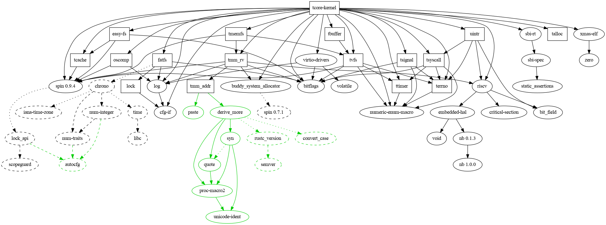

# tCore

## Dependencies

- `kernel-sync`: Interrupt-safe Mutex in zCore
- `rust-fatfs`: A third-party fatfs implementation, modified for thread-safety.
- `easy-fs`: Filesystem in `rCore-tutorial`
- `tcache`:
  - `trait CacheUnit`
  - `LRUBlockCache`
- `tmm_addr`:
  - `VirtAddr` and `PhysAddr`
  - `Page` and `Frame`
  - `PageRange` and `FrameRange`
- `tmm_rv`:
  - `PTE`
  - `PageTable`
  - `frame_alloc` and `frame_dealloc` using `buddy system`
- `tsyscall`: Syscall interfaces and types
- `talloc`: `RecycleAllocator`
- `ttimer`: `TimeSpec` and `TimeVal`
- `tvfs`: `trait File`, `Path` to handle
- `terrno`: `errno` constants
- `tmemfs`: `MemFile`, `NullFile`, `ZeroFile`
- `tbuffer`: `UserBuffer` for translation, `RingBuffer` for `sys_pipe2`
